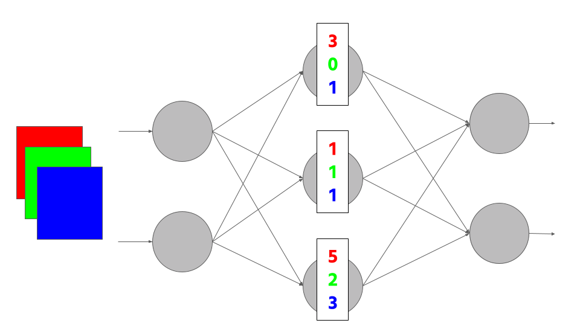
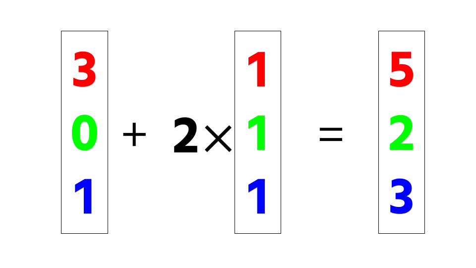

LiNNA
=====
**LiNNA (*Linear Neural Network Abstraction*)** is a Python library for abstracting feed-fordward
neural networks. The abstraction can then be used to speed up verification or
to gain insights about redundancies in the network.
The idea is to replace neurons by a linear combination of neurons
and thereby reduce the overall size of the network.

In addition, **LiNNA** implements the recently proposed *bisimulation* for neural
networks by Prabhakar (see [Bisimulations for Neural Network Reduction](https://link.springer.com/chapter/10.1007/978-3-030-94583-1_14))
and the previously proposed **DeepAbstract** (see Publications for details).

For more information, we refer to the [LiNNA documentation and website](https://calvin-chau.com/LiNNA/).

Getting Started
---------------

You can install LiNNA by running `python setup.py install`. 
Please note that it will install Pytorch with CUDA as default. If you don't have a GPU, please run `pip3 install torch torchvision torchaudio --index-url https://download.pytorch.org/whl/cpu` first.

If you want to use the L2-coefficient-finder, please also install Gurobi (e.g. `pip3 install gurobipy`) and make sure you have an active license ([Gurobi](https://www.gurobi.com/academia/academic-program-and-licenses/)).

Please check out the folder `example` and run `python example.py` to see how LiNNA abstracts a network on MNIST with 3 layers and each 100 neurons by 50%.

To run LiNNA, you can simply call it from the command line `linna -n NETWORK -rr REDUCTION-RATE -d DATASET`.
You can additionally specify the method for finding a basis, i.e. `-b {greedy,greedy_pruning,variance,kmeans,dbscan,random}`, the method for computing the coefficients, i.e. `'c {l1, l2}`, and whether/where to store the abstraction, i.e. `-st FILENAME`.

What does LiNNA do?
-------------------
LiNNA is computing an abstraction of a given neural network. An abstraction is essentially a smaller version of the original, but with guarantees on its similarity (details can be found in the [paper]()). 
The key idea of LiNNA is to use *semantic* information of the neurons, i.e. information that is also based on the particular inputs to the neural network.
The abstraction is then computed by using linear combinations of neurons.

### General Idea ###
We use a set of inputs (i.e. subset of the training dataset) as input for the neural network. 
For each neuron in a particular layer (i.e. a layer we want to abstract), we gather all output values on this input set.  
 


Suppose we have a red, green, and blue input to the network. Each of the neurons in the hidden layer will have outputs for each of the inputs.

In this case, the first neuron will output [3,0,1], the second [1,1,1], and the third [5,2,3].



We realize that the third vector can be produced by taking once the first vector and twice the second vector.
Therefore, we will "replace" the third neuron by a linear combination of the first and second neuron.

"Replace" in this case means that the first and second vector will contribute to the next layer according to the weights of the third neuron, such that the third neuron can be removed but its contribution to the next layer is kept.

### Linear Combination of Neurons ###
Since the key idea of LiNNA is to replace one neuron with a linear combination of neurons, there are two relevant questions:
- What are neurons that can be replaced easily? Or dually, what neurons are good as a "basis"?
- How to find the coefficients for the linear combination?

We have two variants for each of the questions:
1. Finding good neurons to keep:
   - greedy, i.e. one-step-look-ahead
   - heuristic based on the variance in the values of the neurons
2. Finding the coefficients:
   - Linear programming
   - Orthogonal projection

Using LiNNA
-----------
You can call LiNNA by using `linna` from the command line.

It expects three parameters:
* `-n NETWORK` for the network (a filename, which contains a Pytorch.nn.Sequential model)
* `-d DATASET` for the dataset (name of the dataset, e.g. "mnist", "cifar10", "kmnist", "fashionmnist")
* `-rr REDUCTION-RATE` for the ratio of neurons that should be removed (e.g. 0.5 for 50% of neurons)

One can additionally specify the following:
* `-b BASIS-FINDING` to specify the method for finding a basis
  * `greedy` corresponds to the one-step-look-ahead, starting from an empty set of neurons that are in a layer and adding one neuron after the other that shows the best performance
  * `greedy_pruning` corresponds to the one-step-look-ahead, but starting with a full layer of neurons and removing one at a time that can be represented best by the remaining neurons
  * `variance` corresponds to the heuristic based on the variance
  * `kmeans` corresponds to the DeepAbstract-method of clustering with KMeans
  * `dbscan` corresponds to the DeepAbstract-method of clustering with DBSCAN
  * `random` is randomly selecting a subset of neurons
* `-c COEFFICIENT-FINDING` to specify how to compute the coefficients for the linear combination
  * `l1` corresponds to the linear programming, because this will find the optimal coefficients in terms of the L1-norm
  * `l2` corresponds to the orthogonal projection, because this will find the optimal coefficients in terms of the L2-norm
* `-s` for using the *syntactic* data instead of the semantic. This will use as input not the values of the neurons on a set of inputs, but rather the incoming weights of the neurons.
* `-st FILENAME` to store the resulting abstract network as a pytorch-model at the location `FILENAME`

Some example commands could look like this:
* `linna -n example/MNIST3x100 -rr 0.3 -b greedy -c l1 -d mnist` (terminating in ~1min)
* `linna -n example/MNIST3x100 -rr 0.3 -b variance -c l1 -d mnist` (terminating in ~10s)
* `linna -n example/MNIST3x100 -rr 0.1 -b greedy_pruning -c l2 -d mnist` (terminating in ~20s)
* `linna -n example/MNIST3x100 -rr 0.3 -b variance -c l1 -d mnist -s` (terminating in ~5s)


Citing LiNNA
------------
```
@article{chau2023syntactic,
      title={Syntactic vs Semantic Linear Abstraction and Refinement of Neural Networks}, 
      author={Calvin Chau and Jan Křetínský and Stefanie Mohr},
      year={2023},
      eprint={2307.10891},
      archivePrefix={arXiv},
      primaryClass={cs.LO}
}
```

Authors
-------
*LiNNA* is developed and maintained by [Calvin Chau](https://calvin-chau.com), [Stefanie Mohr](https://www7.in.tum.de/~mohr/) and [Jan Křetı́nský](https://www7.in.tum.de/~kretinsk/)
at the [Technische Universität Dresden](https://tu-dresden.de) and [Technical University of Munich](https://www.in.tum.de/en/in/cover-page/).

Publications
------------
> **Syntactic vs Semantic Linear Abstraction and Refinement of Neural Networks**
> <br>*Calvin Chau, Jan Křetínský, and Stefanie Mohr*
> ([Paper](https://link.springer.com/chapter/10.1007/978-3-030-59152-6_5), accepted at ATVA 2023)

>**DeepAbstract: Neural Network Abstraction for Accelerating Verification**
> <br>*Pranav Ashok, Vahid Hashemi, Jan Křetínský, and Stefanie Mohr*
([Paper](https://link.springer.com/chapter/10.1007/978-3-030-59152-6_5), ATVA 2020)